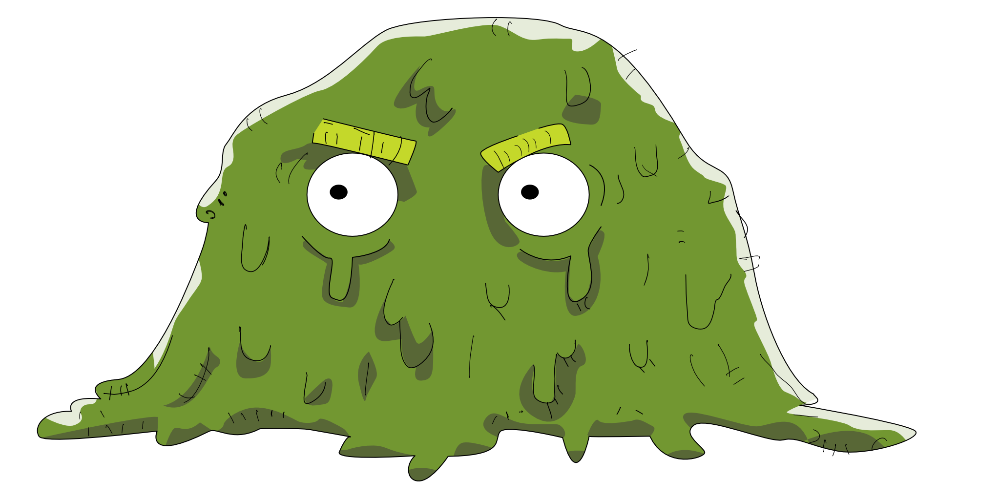
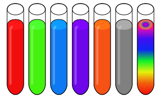

[comment]: # (*.title*Yummy Tubes*.title*)
[comment]: # (*.desc*A small game for Weekly Game Jam 29*.desc*)
[comment]: # (*.tags*unity, C#, weekly game jam, wgj29, jam, affinity designer, graphics, art, 2018, finished*.tags*)
[comment]: # (*.date*5-2-2018*.date*)

# Yummy Tubes

#### *February 5th, 2018*

Still high with the excitement of finishing the [Global Game Jam](/blog/2018/1/gg2018.html), I went home and started looking for something new to work on. I found the 29th *Weekly Game Jam*, and decided to try my hand at doing it. I had tried to do this jam several times before, but had never actually finished a project. But this time, I was determined. And so, I spent every single minute of my free time during that week working.

I found some reference images, and created this beautiful goo monster using Affinity Designer (I may have relied on the reference a bit too much... I'm not at artist).

I had recently discovered a 2D animation application called `OpenToonz`, and I decided to give it a try. I managed to animate the goo character, creating rudimentary idle, moving and jumping animations.

I also created these tubes, and some graphics for the background/levels.

The gameplay itself is relatively simple; your goal is to collect a number of tubes in every level and return them to your hideout before you run out of health and die. You can only pick up one tube at a time, and you have to decide whether you want to return that tube to the hideout, or consume it and restore some of your health/time. Each color of tube also had some extra effect. The red one gave more health, one of them reversed the controls, and my favorite, the rainbow one, used Unity's post processing stack to change the hue of the entire game and change the song, giving a weird but fun vibe.

Looking back, there's a lot that could be improved. Mainly, the player controller, which feels too floaty, and the background art, as well as some minor bugs. But this was still the first solo game I ever finished, and for that, I am proud.

You can play [Yummy Tubes here](https://hadidanial.itch.io/yummy-tubes).