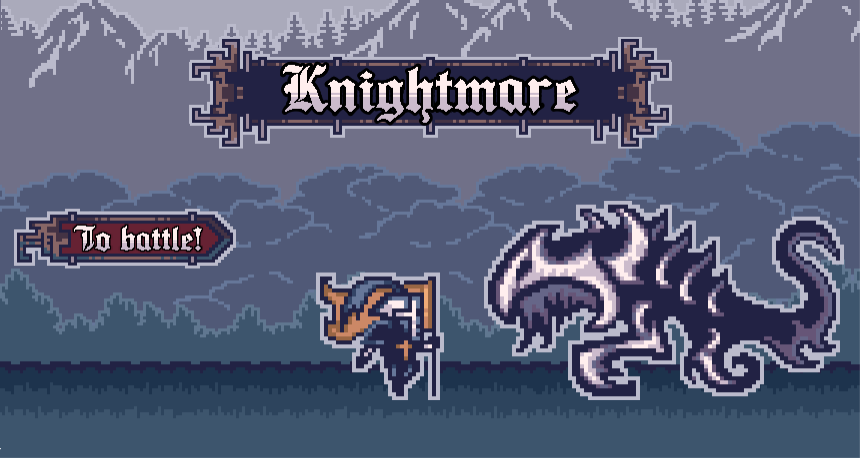
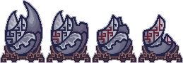
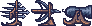

[comment]: # (*.title*Knightmare*.title*)
[comment]: # (*.desc*My Ludum Dare 41 entry, Knightmare.*.desc*)
[comment]: # (*.tags*unity, C#, game, ludum dare, ld41, jam, 2018, project, finished*.tags*)
[comment]: # (*.date*25-4-2018*.date*)

# Knightmare

#### *April 25th, 2018*

You can play [Knightmare here](https://krasse.itch.io/ld41-2). Ludum Dare page [here](https://ldjam.com/events/ludum-dare/41/knightmare).

Ludum Dare time! This time, I teamed up with some people I met on Crowdforge and Discord, and we made **Knightmare**. The theme was `Combine 2 Incompatible Genres`.

This was supposed to be a mix between tower defence and a side scrolling platformer. The base, a mysterious egg, is being attacked by monsters from both sides, and you have to defend it.

The gameplay itself was simple: The enemies spawn in waves, and move towards the egg. When they reach it, they deal damage and die. Your goal is to kill them before they do, making sure the egg is not destroyed. You play as the knight, and you can do a dash attack that does a small amount of damage. You can also control some medieval ranged weapons that spawned on some waves and use them to kill the enemies.

As each wave starts, an indicator flashes to indicate which direction the enemies will be coming from. When the base or enemies are damaged, they change color briefly.

The weapons only activate when you get within a certain distance from them, and they aim towards the mouse. Each type of weapon has a different speed, ammo amount, and strength. When all the ammo is used up, you need to leave the active zone in order for the weapon to recharge.

### The wave system worked like this:

Each `Wave` consisted of an array of `MiniWaves`, a `Scriptable Object` that contained all the different enemy types, and a game object that held all of the wave's platforms and weapons.

Each `MiniWave` has an amount of enemies to spawn, which side to spawn them in, how long to wait between spawning the enemies, what type of enemy to spawn, whether the platforms and weapons should be activated or not, etc... as well as some strings to show when the wave starts and when it ends, which can be used as hints, or for story purposes.

After all the `MiniWaves` are over, the `WaveManager` moves on to the next `Wave`.

This way, we could quickly create waves in the inspector.

### Looking Back

This was a challenging project. I had to do most of the code, as the second programmer had a family emergency and couldn't dedicate the time. Luckily, Per, who did the music, was also a skilled programmer and saved the day by helping to fix bugs and add features, game states and wave states, as well as implement the music, and countless other things.

Unfortunately, there was a lot that could have been done much better.

1. The dash was really inconsistent, which we didn't notice until we had a web build up near the end of the jam. It worked fine in the editor, but I had accidentally made it frame rate dependant, which is terrible for something that is supposed to be precise. The length of the dash would vary *a lot* between uses.

2. The balancing of the game could use a huge rework. The weapons are too powerful, and the dash is not really useful when you have weapons available. For most waves, you could spam the crossbow/fast weapon to deal with most enemies. The damage values of both the weapons and the enemies need to be readjusted, and the player's movement feels too fast at times, and too floaty. The layout of the levels and waves should be redone from scratch. We wanted to add a level with more verticality, in order to emphasize the platforming aspect of the game, but we ran out of time.

3. The wave text UI is, honestly, terrible. The font on the tips, the color, the background, and positioning all make it hard to read, and it doesn't fit with the art. There are also some buttons that are just the default Unity button, when we could have used the button from the main menu for those, and had the artist make something for the rest of the UI. At the very least, the font and color should have been adjusted. But we ran out of time for that, and we were busy trying to fix last minute bugs to really dedicate any more time to it, other than making sure it works.

4. This was the first time I worked with pixel art. I had no idea how to deal with pixel art in Unity at the time, which led to some frustration, as the anti-aliasing worked its magic on the beautiful art. I didn't know what a reasonable size was for the art itself, so I had to try and make it up along the way, which I'm sure the artist didn't appreciate. Especially when I asked for art in a gigantic resolution.
