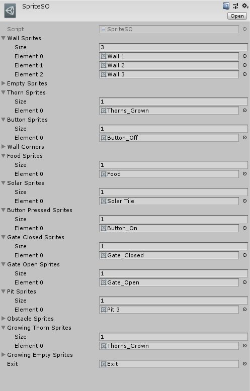

[comment]: # (*.title*Snakescape*.title*)
[comment]: # (*.desc*My Ludum Dare 42 entry, Snakescape.*.desc*)
[comment]: # (*.tags*unity, C#, game, ludum dare, ld42, jam, affinity designer, graphics, art, 2018, project, finished, featured*.tags*)
[comment]: # (*.date*16-8-2018*.date*)

# Snakescape

#### *August 16th, 2018*

You can play [Snakescape here](https://krasse.itch.io/snakescape). Ludum Dare page [here](https://ldjam.com/events/ludum-dare/42/hissterics).

**Snakescape** is another Ludum Dare game I worked on. We scored 273rd in the Overall category! The theme was `Running out of space`. I teamed up with some of the people I worked on [Knightmare](../4/knightmare.html) with again. We didn't have an artist for this one, so I had to do the art myself.

Snakescape is an unconventional snake game - instead of the traditional snake gameplay, we opted for a puzzle oriented experience. With movement snapped to a custom grid system, the player has to reach the exit of each level, which is usually blocked and can only be opened by pressing a button. The player can eat eggs to get bigger, or consume the purple drops to get smaller. You have to manage your length, as getting too big can get you stuck, and being to short would block you from crossing pits. There are also vines that can kill you, and they grow with time, blocking off certain paths.

### The Grid System

We decided we wanted the snake's movement to be locked to a grid. I had some experience with creating those from previous projects, so I started by working on that. The `Grid` script takes a size, a `Cell` prefab, and a Scriptable Object that contains all the sprites for the different types of cells.

The `Grid` script spawns all the cells, and generates a `2D array` that is the size of the grid +2 in each axis, to account for the walls. It names all the cells per their location in the grid, and chooses a sprite for the cell. The sprite's rotation can also be controlled.

At the time, I wasn't familiar with editor scripting, so changing each cell's type was very cumbersome and time consuming - each cell had to be changed by itself, and then the entire grid had to be refreshed. I didn't have time to make it more user friendly, unfortunately, which I deeply regretted as we started making levels.

There's also a static `GridChecker`, that can find the `Cell` in a `Grid` by a `Vector2` location, check whether the cell can be used, and if the cell is an edge.

### The Snake

After the `Grid` system was done, it was time to create the `Snake` and define how it moves. The `Snake` script was responsible for snapping the snake to the grid, moving it on the grid/2D array, rotating the head, and growing and shrinking it.

The `SnakeController` script took in the player's input, and checked if the snake could move in that direction on the grid. If it could, it send instructions to the `Snake` script to move the head and update all the body parts.

### The Art

We didn't have an artist working with us on this project, and we didn't even have any decent placeholder art. So, on the last day, I opened up Affinity Designer and started working. I'm not an artist, but I know my way around design, and considering the game was based on tiles, I managed to create all the art for the game in ~6 hours. I'm actually happy with how it turned out, and it gave me some confidence regarding my abilities.

### Looking Back

Once again, as it is a jam game, there's a lot that could be improved upon.

1. The level editing was a pain, and it really needs to be made more user friendly. I wasn't aware of Unity's Tilemap system at the time of this jam, but maybe that would have helped, and saved us a lot of time and trouble creating the custom grid system and manually creating the levels.

2. The gameplay turned out to be fine. There were no major bugs, so that's good, but we should have made a *lot* of extra levels. The ones we had were good, but the game ended up being too short.
