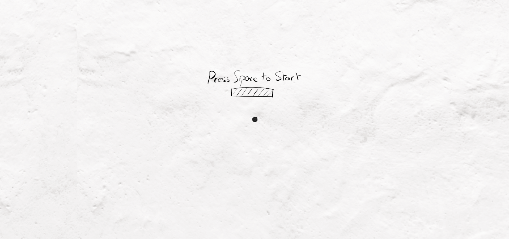
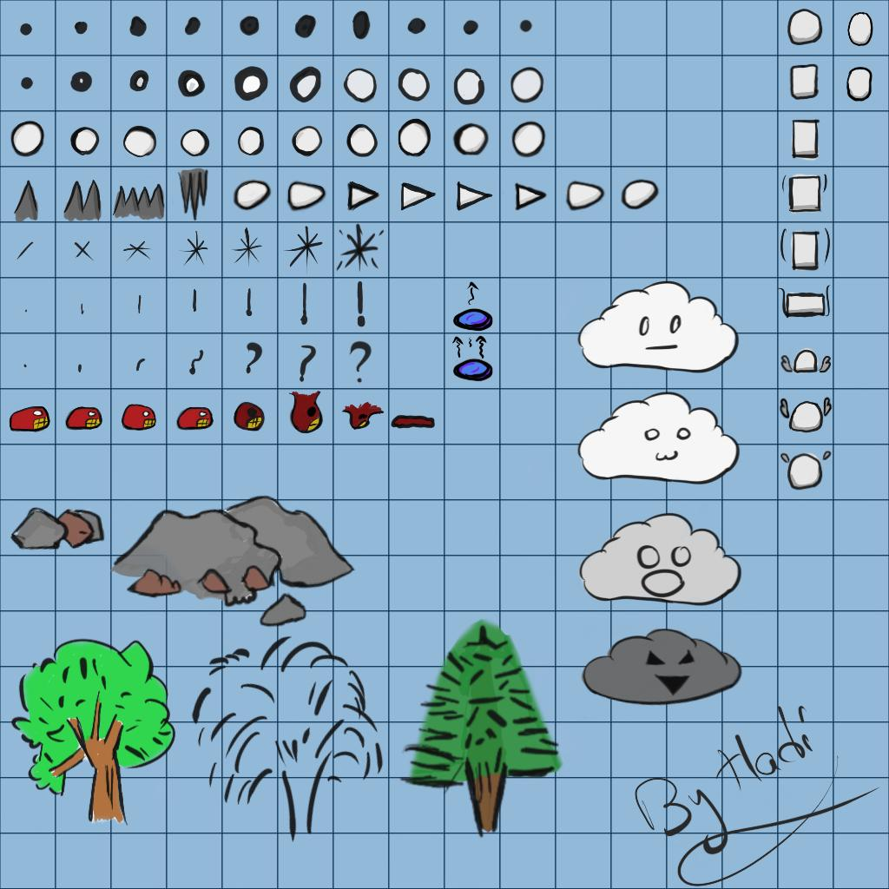
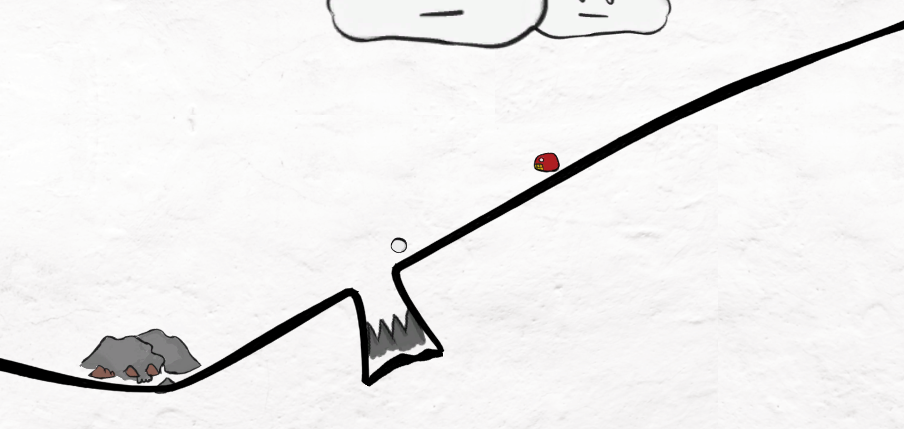

[comment]: # (*.title*Dot*.title*)
[comment]: # (*.desc*My Ludum Dare 45 entry, Dot*.desc*)
[comment]: # (*.tags*unity, C#, game, ludum dare, ld45, jam, 2019, art*.tags*)
[comment]: # (*.date*20-10-2019*.date*)

# Dot

#### *October 20th, 2019*

You can [play the game here.](https://hadidanial.itch.io/dot), Ludum Dare page [here](https://ldjam.com/events/ludum-dare/45/dot).

Dot is a small game I made for the Ludum Dare 45 game jam. The theme for the jam was `Start with Nothing`. I had been trying to be more creative and do some Inktober prompts in the days prior to the jam, so when the theme was announced I immediately found a concept I liked. The idea was to go for an inky art style with hand-drawn graphics, to match with Inktober, and to start with a blank sheet of paper, revealing more and more of the world as you progress.

### The Art

My main focus for this project was the art. It inspired the idea, and I wanted to try out a new style. I used Sketchbook to draw it all out, and I spent a lot of time going back and forth, tweaking the frames and adding new ones. This was my first time doing frame-by-frame animation, and also the first time I actually drew art for a game instead of using vector art.

I had two sprite sheets for the art: one with color, and one without. The game starts with no color, and at a certain point in the game, the sprite sheet gets switched with the colored one, causing the world to suddenly become more colorful.

In the end, I'm happy with how the art turned out, and I'm looking forward to improving in this area in the future.

The level is made using Unity's Spriteshape, which made it easier to create a level in-engine. I still wanted to add variety to the way the platforms looked, so I used an uneven sprite for the line. It looked great, but it also unfortunately meant that the edge collider I used was not accurate, leading to confusion for the players and making the game harder than it should have been.

To create the transition from black and white to colored for all objects in the game, I created a simple shader using `Shader Graph`, which in hindsight was not needed for what I ended up doing, and used the same material for everything, changing the texture in the material at the required point, which affected the entire game. I wanted to animate the transition, but I did not have time to do that.

As for the effect that reveals the world, it was simple `sprite masks` for each section, each with its own sorting order, and whenever I wanted to reveal the world, I would scale up the sprite mask with a coroutine. I used this mask I made in Affinity Designer, which created this neat effect where a sprite would be revealed, then disappear, then get revealed again.

### Player

As for the gameplay, I created several scripts to get everything working. It's a miracle everything ended up working in the end, as I had no chance to stop and test each feature and if it worked well with other parts of the system.

The `Player` has several states:

- **Sleep**: This is the starting state of the player, and the one he goes into after death. The player can't move in this state.
- **Move**: In this state, the player can move, jump, and transition to any of the other states.
- **Stomp**: The player goes into this state when performing the stomp attack. All horizontal movement is cancelled, and the player now kills enemies it touches instead of dying. The only way to get out of this state is to touch the ground, or die by hitting an obstacle.
- **Dash**: This is the player's second attack. Here, the player turns into a spike and moves horizontally quickly for a small amount of time, killing enemies, then returns to the `Move` state.

### Enemies

Enemies are simplistic: They follow a waypoint system, moving from one to the next, and kill the player on contact. In the end, all of them either had only two waypoints, or were completely stationary due to time constraints in designing the levels.

### World Manager

To manage all the different sections that I wanted to reveal gradually, I created a `World Manager`, which has an array of `World States`. The states were more like sections of the world, and each had a checkpoint that, when reached, would either trigger the next state to load, or trigger the win message, depending on whether or not it was the last state in the manager, as well as a list of all the enemies contained in that section.

When a state was activated by the manager, enemies were reset, the level would be enabled, and the mask hiding the level would begin scaling up.

The world manager kept track of the current state, and would reset the player to the last reached checkpoint on death, as well as set the Player State to **Sleep** and tell the current world state to reset itself, it's enemies, and then reveal the state again.

### Other

As for miscellaneous features, I added an interest marker script to the player, which was supposed to show the play where new sections of the world had been revealed, but I didn't have time to implement it into the gameplay, and a tip manager, which displayed tips whenever the player got into certain areas.

### Looking back

A lot of the comments criticized the controls, which is a valid complaint, and felt that the player's hitbox was too big, which was caused by the inaccurate colliders for the platforms.

Another big complaint was the lack of music and sound effects, which I regret, as it would have made the game that much better. I tried to record my own, but I unfortunately have no experience with editing audio, and I ran out of time before I could find something I liked.

Other than that, the level design was somewhat unclear, in that some players didn't realize that sections of the world had been revealed in areas you had already crossed after the first checkpoint. This could have been fixed if I had fully implemented the "Interest Marker" system I had planned.

The level itself was too short, and not well designed, especially the last enemy on the slope. I introduced the player's abilities, but didn't give players the chance to learn to use them. The first enemy, right after learning to dash, can be jumped over, when it's meant to be dashed through. This means that players won't learn to dash, making it near impossible to kill the enemy on the slope. I had hoped to create more levels, and make a longer game, but I barely managed to create the level in the last few hours of the jam, while hooking all the systems together.

I spent around 18 hours working on the game, and overall, I'm happy with this entry, especially the art. A **lot** could have been done better, but for the time I had, I'm happy.

