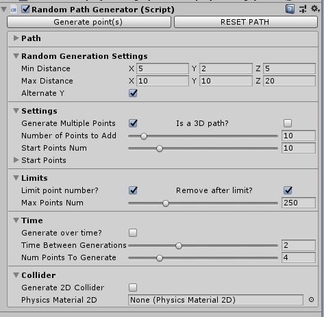

[comment]: # (*.title*Path Creator*.title*)
[comment]: # (*.desc*A fork of Sebastian Lague's Path Creator for Unity, with path generation and Path to SpriteShape conversion*.desc*)
[comment]: # (*.tags*unity, C#, editor, path, path-creator, github, finished-project*.tags*)
[comment]: # (*.date*10-2-2019*.date*)

# Path Creator

#### *February 10th, 2019*

[Github link](https://github.com/hadiDanial/Path-Creator). This is a fork of Sebastian Lague's [Path Creator for Unity](https://github.com/SebLague/Path-Creator).

I had been interested in path based movement for a while, so when Sebastian Lague released his Path Creator, I was immediately intrigued. I decided to try and recreate my 2018 Global Game Jam game, [Electric Runner](https://globalgamejam.org/2018/games/electric-runner), using this tool, as it was a buggy mess and could have been done much better.

I ended up focusing more on expanding the path creator tool instead, as I found it challenging and more fun to work on. I think this particular project will prove to be useful in the future. Here are the features I added:

### PathToSpriteShape

The tool had a road mesh generator example script, but I wanted to use a more flexible 2D tool with it, so I started implementing a conversion from the paths to Unity's Spriteshape. Converting from control points to tangents was tricky, but after studying both tools for a while, I managed to successfully create a sprite shape from a path.

Sprite shape is not as flexible as the path creator, and it's not really usable in the same way in real time, but the path creator didn't have any built in rendering capabilities. This is the best of both worlds.

### Path Generators

I built several different types of path generators, most of which can generate points automatically over time. It's possible to limit the total number of points the path has, either by preventing further points from being generated or removing points at the start of the path.

1. **Random Path Generator:** A simple path generator. Can generate points with minimum and maximum x, y, and z values.
   
   
2. **Spiral Path Generator** This generator creates spiral shapes. It can generate around all 3 axis, add variations per cycle(to adjust the shape, make it bigger or smaller), and generate either clockwise or anti-clockwise.
   
   
3. **Polygon Generator**

