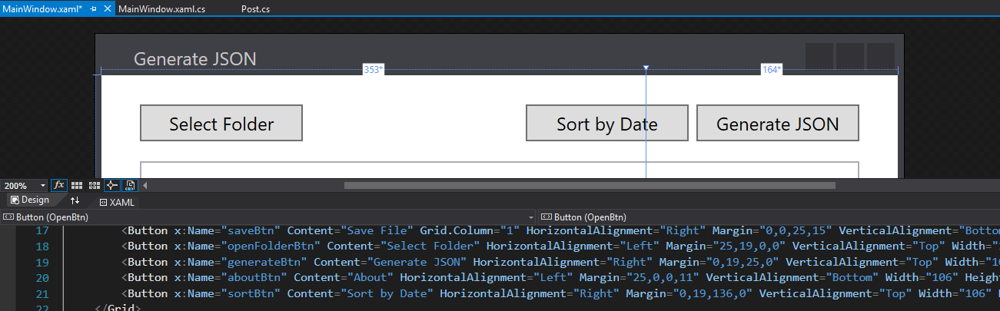

[comment]: # (*.desc*An app that generates a JSON file for the posts on my website*.desc*)
[comment]: # (*.tags*website, C#, WPF, finished-project*.tags*)
[comment]: # (*.title*Website JSON Generator*.title*)
[comment]: # (*.date*3-3-2019*.date*)

# Website JSON Generator

#### *March 3rd, 2019*

This was a small project, made with `C#`, using `WPF`. It looks through a given directory and searches for files that end with `.html`. For each file that it finds, it creates a `Post` object that contains a title, description, date, tags, a cover image, and a path for each post, the data taken from a `.md` or `.txt` file with the same name as the `.html` file. It then generates a `JSON` array with all the posts it found and sorts them by date, then saves the generated `.json` file.

The `.json` file is then used to search the posts and generate links to them in the website.

