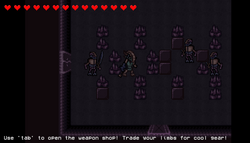

[comment]: # (*.title*Limberman*.title*)
[comment]: # (*.desc*My Ludum Dare 44 entry, Limberman.*.desc*)
[comment]: # (*.tags*unity, C#, game, ludum dare, ld44, jam, 2019, project, finished, featured*.tags*)
[comment]: # (*.date*11-5-2019*.date*)

# Limberman

#### *May 11th, 2019*

You can play [Limberman here](https://krasse.itch.io/limberman). Ludum Dare page [here](https://ldjam.com/events/ludum-dare/44/limberman).

For this Ludum Dare, we made **Limberman**. The theme for the jam was `Your life is currency`,

You can read about the [development of the game here](http://www.hadidanial.com/blog/2019/5/limberman_devlog.html)

Limberman is a short dungeon crawler made in 3 days for LD44. In this game, your goal is to get through all the rooms in the game, killing all the enemies. The idea was that you'd have to trade your limbs in order to be able to buy weapons, which would give you debuffs such as slower movement speed or less health, but also give you more firepower. Unfortunately, we overscoped, and so ended up with a buggy shop that doesn't encourage the player to try and strategize. Should have definitely went for a simpler project. But this was still plenty of fun to work on, and it was pretty challenging!

### Looking Back

If I had to do it again and had more time, I'd make sure to create more levels and to recreate the shop. Otherwise, I'd seriously cut down the scope and make a simplified version of the game.

