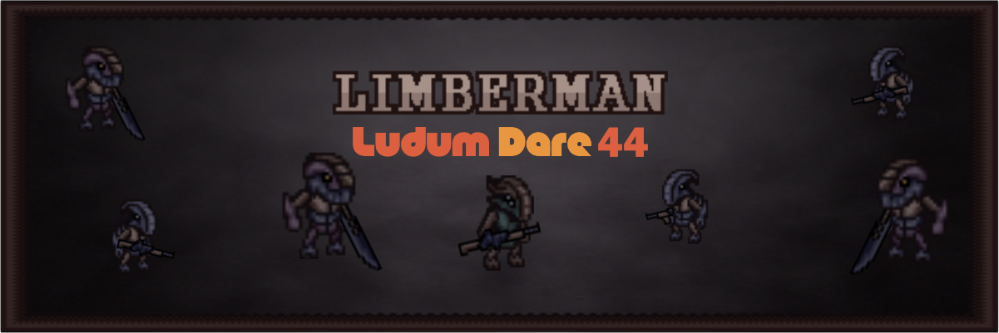

[comment]: # (*.title*Limberman*.title*)
[comment]: # (*.desc*My Ludum Dare 44 entry, Limberman.*.desc*)
[comment]: # (*.tags*unity, C#, game, ludum dare, ld44, jam, 2019, project, finished, featured*.tags*)
[comment]: # (*.date*21-5-2019*.date*)

# Limberman

#### *May 21th, 2019*

You can play [Limberman here](https://krasse.itch.io/limberman). Ludum Dare page [here](https://ldjam.com/events/ludum-dare/44/limberman).

For this Ludum Dare, we made **Limberman**. The theme for the jam was `Your life is currency`,

You can read about the [development of the game here](http://www.hadidanial.com/blog/2019/5/limberman_devlog.html)

Limberman is a short dungeon crawler made in 3 days for LD44. In this game, your goal is to get through all the rooms in the game, killing all the enemies. The idea was that you'd have to trade your limbs in order to be able to buy weapons, which would give you debuffs such as slower movement speed or less health, but also give you more firepower. Unfortunately, we overscoped, and so ended up with a buggy shop that doesn't encourage the player to try and strategize. Should have definitely went for a simpler project. But this was still plenty of fun to work on, and it was pretty challenging!

### Devlog

There was a lot to do for this game, and I worked on the [Player Controller](#PlayerController), the [Enemies](#Enemies), the [Weapons](#Weapons), and the [Room system](#RoomSystem), the tilemap, and several miscellaneous things, and the other programmer handled all character animations, sounds, the shop, UI, and game manager.

### Player Controller

I started off by working on the player controller while the other programmer worked on creating procedural animations. The player controller handles all player movement and input, as well as manages the `Player Visuals` script that controls the animations to behave according to the current state. The player movement is relatively simple: I get input from the player, normalize it, and set the velocity of the rigidbody accordingly. This also calculates the angle necessary for each weapon to aim towards the mouse.

### Enemies

The enemies have two variations: `Ranged` and `Melee`. They share the same parent class with the basic functionality, and each type has different movement and attack behavior. They also use the same animation system as the Player.

1. **Ranged Enemies:** Ranged enemies move in a random direction, stay there for a number of seconds while shooting at the player, either actively targeting them or shooting at their last location before the enemy stopped moving. Then they move again and repeat the cycle.
2. **Melee Enemies:** These always try to move towards the player, but they don't have any pathfinding, so they try to target a location either to the left or right of the player and move there. When they get close enough, the attack animation is triggered, and if their sword hits the player, it deals damage.

### Weapons

The weapons in this game are very simplistic: they shoot `x`-bullets per second, and each bullet is a prefab that has a certain speed and deals a certain amount of damage.
The rotation of the weapons get set automatically. For the player, the rotation is set towards the camera, with some clamping so you can't shoot directly above or below yourself, and for the ranged enemies, the weapons were aimed towards a target's current location.

#### Swords

The `Sword` script is just an `OnTriggerEnter2D` function that deals a certain amount of damage to whatever it hits when the attack animation is played. The collider for the sword only gets activated at certain points during the animation. They also have a trail renderer for an added visual effect.

### The Room System

The goal was to have the player travel through a set of hand crafted levels that were placed randomly, so each playthrough would be different. I whipped this up first thing on the last day.

1. **Room:** Each room has a list of doors and a list of enemies. When all the enemies are defeated, all the doors in the room are unlocked and the room status is set to done.
2. **Room Manager:** The manager is responsible for randomly placing the rooms in a grid layout, as well as assign the doors of each room to transport the player to the correct room based on the new layout. The rooms are placed in a 2D array and the location of each room is then calculated and set.
3. **Door:** Each room has 4 doors, and each door can have one of 3 possible states: Locked, unlocked, and inactive. They also have a set of sprites for each state.
Doors are set as `inactive` if there are no more rooms in the direction the door is leading. Otherwise, the door's state would be triggered from the `Room` script.

### Tilemap

For creating the levels, we used Unity's Tilemap system, along with Rule Tiles from the 2D Extras package from github, which made it easy to edit levels. We ended up only creating rectangular levels, so we didn't take advantage of the system.

### Looking back

This was a very fun, yet stressful project. If I had to do it over again, I'd cut down on the scope, and rework the limb system and the shop, and create more varied level types, instead of all rectangular rooms. But for a jam, I'm happy with how much we got done.

I have recorded (almost) all of the work, and I might be uploading a timelapse video eventually.