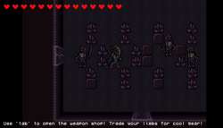

[comment]: # (*.title*Limberman Dev Log*.title*)
[comment]: # (*.desc*Developement Log and Postmortem for Limberman*.desc*)
[comment]: # (*.tags*unity, C#, game, ludum dare, ld44, jam, 2019, post*.tags*)
[comment]: # (*.date*12-5-2019*.date*)

# Limberman Dev Log

#### *May 12th, 2019*

You can [play the game here.](http://www.hadidanial.com/blog/2019/5/limberman.html)

## Devlog

There was a lot to do for this game, and I worked on the [Player Controller](#PlayerController), the [Enemies](#Enemies), the Weapons, and the Room system, the tilemap, and several miscellaneous things, and the other programmer handled all character animations, sounds, the shop, UI, and game manager.

I have also recorded (almost) all of the work, and I might be uploading a timelapse video eventually.

