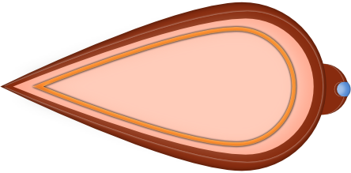

[comment]: # (*.title*Core Defender*.title*)
[comment]: # (*.desc*My entry to Ludum Dare 47.*.desc*)
[comment]: # (*.tags*unity, C#, game, LD47, ludum dare 47, project, jam, 2020, finished*.tags*)
[comment]: # (*.date*10-10-2020*.date*)

# Core Defender

#### *October 10th, 2020*

You can play Core Defender [here](https://hadidanial.itch.io/core-defender), Ludum Dare page [here](https://ldjam.com/events/ludum-dare/47/core-defender). It was made by me in under 72 hours.

It was time for Ludum Dare 47, and I couldn't wait to participate in the jam again! After some consideration, I decided to go solo and challenge myself to see what I could come up with. Alas, I ended up over-scoping the project and spent a lot of time on the incomplete art.

The theme for LD47 was 'Stuck in a loop', and after some brainstorming, I came up with the idea that the player would be stuck moving along looping "rails", as some kind of defense bot protecting an ancient temple or some abandoned facility.

I used my (admittedly outdated) [fork](https://github.com/hadiDanial/Path-Creator) of Sebastian Lague's [Path Creator](https://github.com/SebLague/Path-Creator), with shape generation and conversion to Unity's own Sprite Shape, to create the paths my player could navigate along.

The goal of the game is to kill all the enemies without getting killed, while preventing them from destroying the cores powering the defence systems of the mysterious chambers that you are protecting.

### Weapons

The weapons are simple enough. These are their main functions:
    - Rotate towards target using Quaternion.Slerp().
    - Can only fire if the time between shots has elapsed *and* the last shot has finished firing, which is set by an animation event after the animation is done.
    - Spawn the ammo prefab and give it rotation, direction, speed and damage stats, also triggered via animation events at the appropriate time. The ammo prefab can spawn at all the specified spawn points in the weapon.
    - Activate/Deactivate when switching to another weapon.

The hardest part was getting all the rotations to work as intended.
There is a variation on this base weapon script for the MultiBlaster weapon, as that one has three weapons instead of one. The differences being setting the rotations for each child Weapon on Start, and that when the Shoot() function is executed, it calls the original Shoot() function for each child Weapon.

### The Player

I started off with the FollowPath script from Sebastian's project, and modified it to support 2D rotations, which didn't really matter in the end as the player's body was very small on-screen and it was hard to notice.

The player has a list of weapons they can switch between: Blaster, MultiBlaster, and Rocket Launcher. After the current "level" is finished, the player is set to a new path to advance to the next area.

### Enemies

There are several types of enemies in the game. I used the [`Astar Pathfinding Project`](https://arongranberg.com/astar/) for the "AI", and it came out better than I could've done myself. It went relatively well, considering it was my first time using A*. I initially had some trouble getting it to work, and when I did I found that the performance had tanked. Luckily, the fix was simple. I was calculating a new path waaaay too often.

Some enemies target the player, some target the cores, and some can target both. Unfortunately, I believe this came out bugged in the final jam version for some reason and enemies mostly targeted the player.

There are two different types of enemies: Hunters and Blasters.

Hunters are the star shaped enemies, and they follow the player and try to hit them physically. After a successful hit, hunters bounce off for a short time then swoop in for another attack.

Blasters get within range of the player and fire towards their target, be it player or core. There are two variations of this enemy: single Blaster and MultiBlaster.

### Levels

Each `Level` has its own `WaveManager`, which handles the spawning of enemies in `Waves`, and notifies the level when it has been completed. Each level keeps track of all the `Cores` it contains, and if any are destroyed, it triggers a game over.

Each `Wave` keeps track of its enemies and how many were killed, and when it is over, it tells the manager to start the next one. If all the waves are done, the next level is started instead.

`Wave` is a simple Serialized C# class, while the `WaveManager` is a `ScriptableObject`, which allows me to create different waves from the editor and duplicate/swap them between levels as I see fit.

### MathP

Quaternions are hard.

Every few months, when I need to deal with them in a jam, I get all confused and waste precious time. During my last side project, I created the `MathP` class, and I've added a few functions to it during the jam. It is still very bare-bones, but I hope to continue using and improving it as time goes on and I develop more games. As it stands, this is the current version, and it is focused on 2D. I cannot guarantee that it's bug free, but this is what I have so far. I ended up using it to handle Quaternion calculations throughout the game.

I will probably rename it to something else eventually, as the P is related to that particular project and its requirements.

[Download here](core_defender_assets/MathP.cs)

### The Art

As always, I used Affinity Designer to create the art.

I am happy with how some things turned out, but I failed to create art for the backgrounds and environments, which forced to use a rather bland room.

Still, the player, enemies and weapons turned out decent, in my opinion at least, and the animations weren't too bad.

These are the "rails" that the player moves on. I initially envisioned an abandoned temple in a jungle somewhere, but when I couldn't create the environment art in time, I ended up recoloring them in-engine.

I used the `All In 1 Sprite Shader` asset from the Unity Asset Store to create some effects, most notably the hit effect on enemies and recoloring the rails.

### Looking Back

I extensively used events during this jam, and it was an interesting and very useful tool to have.

As for the game itself, it is lacking in level design, and I had to rush to connect all the different systems during the last couple of hours, so I didn't have much time to create content or do any bug testing. The result is a *very* short game without any substantial content. Then again, it is a jam game with very limited time. Lesson learned, stop over-scoping jam games!

On the technical side, however, I think it went great. I've always been much better at the technical stuff rather than the artistic and design sides. There are a few bugs here and there, of course, but I'm getting better and better at making systems that work together.

It was very fun to do a jam again, especially with the current state of the world and quarantines and lockdowns everywhere. I'm afraid that this is the end of the road for this particular project, though. Until next time!

