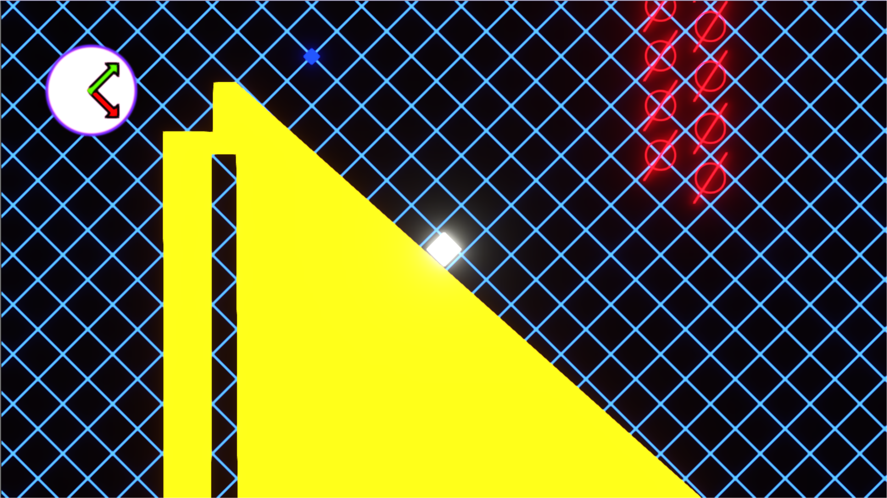

[comment]: # (*.title*Grid*.title*)
[comment]: # (*.desc*My entry to the GamesPlusJam3.*.desc*)
[comment]: # (*.tags*unity, C#, game, gamesplusjam 3,  project, jam, 2020, finished, featured*.tags*)
[comment]: # (*.date*24-2-2020*.date*)

# Grid

#### *February 24th, 2020*

You can play Grid [here](https://hadidanial.itch.io/grid).

Grid is my game for the GamesPlusJam 3. This jam is a little different from the jams I normally do, in that there isn't one singular theme. Instead, the theme is generated for each participant by [this generator](https://gamesplusjames.itch.io/gpjam3-generator) as a combination of two different genres. My theme was: Vector Platformer!

I had just come out of my exam period, and after studying linear algebra for my last exam, which included watching [3Blue1Brown's series](https://www.youtube.com/playlist?list=PLZHQObOWTQDPD3MizzM2xVFitgF8hE_ab) on the subject, this felt like a fitting theme, and I was excited to get to work!

The idea was to make a platformer where the movement and gravity constantly change directions, based on the grid and how it gets transformed.

Instead of the usual left and right movement, the player would move parallel to the transformed x-axis on the grid, and jump along the transformed y-axis.

### The Grid

The grid is a sprite with a custom shader made in Shader Graph.

The `Tiling and Offset` node allows me to repeat the grid along the entire object, the xAxis and yAxis properties get updated by the `GridManager` script, and using matrix multiplication, they allow me to modify the grid in real time to rotate, shear, or transform it in any way I wish.

The `GridManager` animates the transformation. and calculates the gravity direction and movement axis like so:

`gravity = -(vertical.x * Vector2.up - vertical.y * Vector2.right).normalized * gravityStrength;`

`movementAxis = -(horizontal.x * Vector2.up - horizontal.y * Vector2.right).normalized;`

Where vertical is the first column of the matrix, and horizontal is the second column. x is the first row, and y is the second row.

The shader allows me to control the width of the lines of the grid, so I used that to animate the grid, and it resulted in a cool effect to transition from the menu to the game.

### The Player

The player controller was a big challenge. I wanted the player's movement and jump to be dependant on the current grid axis. I ended up calculating the movement as if I were still using the standard XY plane, and then transforming it to the current movement plane by multiplying the movement/gravity axis by the magnitude of the movement vector.

The player checks if it is grounded by casting a couple of rays in the direction of the gravity vector. At first, I wasn't planning on rotating the player, so I had ground check objects on each side of the player and activating one of them based on the gravity direction, and disabling the rest. In the end, though, this wasn't needed as I was rotating the player to face the gravity direction.

### Pickups

The pickups each held two `Vector2` objects: The vertical and horizontal targets. When triggered, the grid changes to follow these two vectors, and the gravity, movement axis and player rotation followed.

### Looking Back

I feel like I need to spend some time learning about game and level design. But I'm proud of this game, especially the technical parts.

The math was hard to get right, but I feel like I learned a lot. Playing with Shader Graph was fun, and getting the movement to finally work was so satisfying. I think I want to explore this mechanic further (without the grid, perhaps).

I think it looks good, albeit with a little too much bloom. It can be a little hard on the eyes. I'm disappointed that I didn't manage to get any audio in it, though.

Overall, I am very happy about this game.
